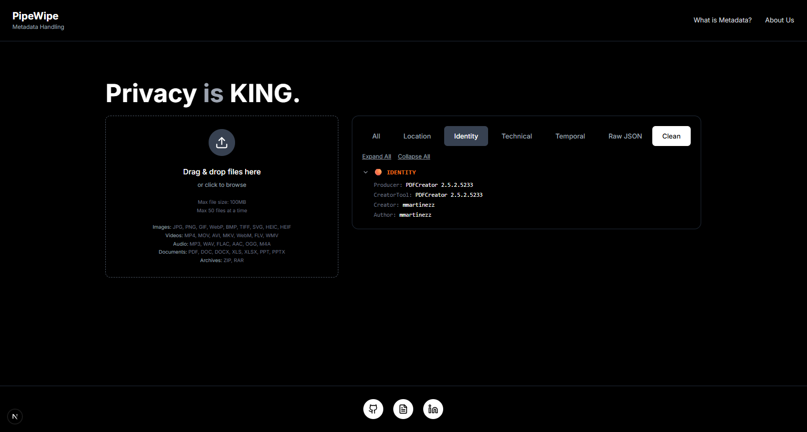

# Privacy-first metadata extraction and removal tool

Web application to extract, analyze, and remove metadata from files with complete privacy. All processing happens in-memory — no files are stored on disk.

[](https://opensource.org/licenses/MIT)
[](https://nodejs.org/)
[](https://nextjs.org/)


---

##  Features

- **Metadata Extraction**: Analyze metadata from images, videos, audio, documents, and archives
- **Smart Removal**: Remove metadata by category, preset, or custom selection
- **Privacy-First**: In-memory processing—files never touch the disk
- **Modern UI**: Clean, responsive interface built with Next.js and Tailwind CSS
- **Fast Processing**: Powered by ExifTool, FFmpeg, and Poppler
- **Risk Assessment**: Automatic privacy risk analysis of extracted metadata
- **Removal Presets**: Pre-configured profiles (Social Media, Professional, Maximum Privacy)

---

## Tech Stack

### Frontend
- **Framework**: Next.js 14 (React 18)
- **Styling**: Tailwind CSS
- **Language**: TypeScript
- **HTTP Client**: Axios
- **Icons**: Lucide React

### Backend
- **Runtime**: Node.js 18+
- **Framework**: Express.js
- **File Upload**: Multer (memory storage)
- **Metadata Tools**: 
  - ExifTool (images, videos, documents)
  - FFmpeg (videos, audio)
  - Poppler (PDFs)

---

## Local Deployment Requisites

- **Node.js** 18 or higher
- **npm** or **yarn**
- **ExifTool** installed on your system
- **FFmpeg** (optional, for video/audio processing)
- **Poppler** (optional, for PDF processing)


---

## Local Installation


### 1. Install Backend Dependencies

```bash
cd backend
npm install
```

### 2. Install Frontend Dependencies

```bash
cd ../frontend
npm install
```

### 3. Configure Environment Variables

**Backend** (`backend/.env`):
```env
NODE_ENV=development
PORT=5000
```

**Frontend** (`frontend/.env.local`):
```env
NEXT_PUBLIC_API_URL=http://localhost:5000
```

---

## Running Locally

### Start Backend Server

```bash
cd backend
npm start
# or for development with auto-reload:
npm run dev
```

Backend will run on **http://localhost:5000**

### Start Frontend Application

```bash
cd frontend
npm run dev
```

Frontend will run on **http://localhost:3000**

---

## Usage

1. **Upload a File**: Drag & drop or click to upload (supports images, videos, audio, documents, archives)
2. **View Metadata**: See extracted metadata categorized by privacy risk
3. **Choose Removal Mode**:
   - **Presets**: Social Media, Professional, or Maximum Privacy
   - **Categories**: Select specific metadata categories
   - **Remove All**: Strip all metadata
4. **Clean & Download**: Download your cleaned file with `_cleaned` suffix

---

## Privacy & Security

- **Zero Data Retention**: Files are processed entirely in-memory
- **No Disk Storage**: Uploads and cleaned files never touch the filesystem
- **Auto-Cleanup**: File buffers are automatically garbage collected after 10 minutes
- **HTTPS Ready**: Secure connections for production deployment
- **CORS Protected**: Configurable origin restrictions

---

## Project Structure

```
PipeWipe/
├── frontend/              # Next.js frontend application
│   ├── src/
│   │   ├── app/          # Next.js app directory
│   │   ├── components/   # React components
│   │   ├── hooks/        # Custom React hooks
│   │   ├── lib/          # Utilities and API client
│   │   └── types/        # TypeScript type definitions
│   ├── public/           # Static assets
│   └── package.json
│
├── backend/              # Express.js backend API
│   ├── src/
│   │   ├── middleware/   # Express middleware (multer, etc.)
│   │   ├── routes/       # API routes
│   │   ├── native/       # ExifTool, FFmpeg wrappers
│   │   └── utils/        # Helper functions
│   ├── server.js         # Express server entry point
│   └── package.json
│
└── README.md
```


---

## Supported File Types

### Images
JPG, PNG, GIF, WebP, BMP, TIFF, SVG, HEIC, HEIF

### Videos
MP4, MOV, AVI, MKV, WebM, FLV, WMV

### Audio
MP3, WAV, FLAC, AAC, OGG, M4A

### Documents
PDF, DOC, DOCX, XLS, XLSX, PPT, PPTX

### Archives
ZIP, RAR


---

## Acknowledgments

- [ExifTool](https://exiftool.org/) by Phil Harvey
- [FFmpeg](https://ffmpeg.org/) for multimedia processing
- [Poppler](https://poppler.freedesktop.org/) for PDF handling
- [Next.js](https://nextjs.org/) for the amazing React framework
- [Tailwind CSS](https://tailwindcss.com/) for styling


---


## Disclaimer

This tool is designed for legitimate privacy purposes. Users are responsible for ensuring they have the right to modify files they process. Always keep backups of original files.

---

## License

This project is licensed under the MIT License - see the [LICENSE](LICENSE) file for details.
